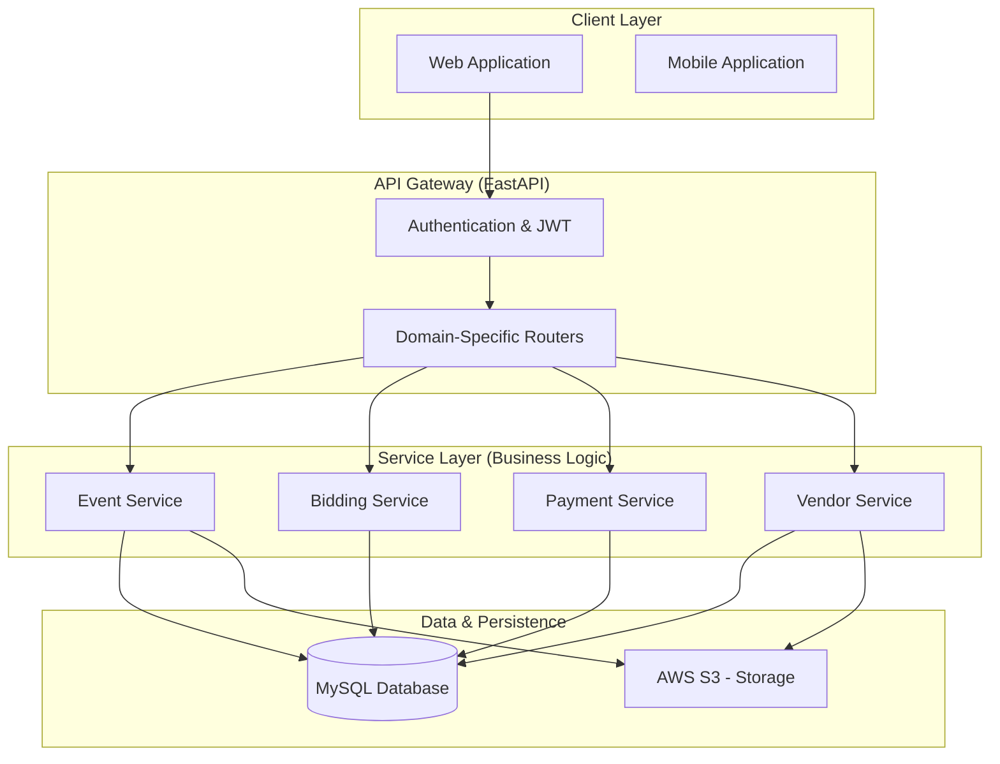

# Evination: High-Level Design Document

## 1. Executive Summary
**Evination** is a comprehensive Event Management Ecosystem designed to streamline the interaction between event organizers (Consumers/Event Managers) and service providers (Vendors). The platform automates the procurement lifecycle for events, including request generation, competitive bidding, order orchestration, and financial settlement.

---

## 2. Target Audience (Actors)
The system supports four primary types of users:
- **Consumers**: Create event requests and select the best bids.
- **Vendors**: List services, browse event requests, and submit competitive bids.
- **Event Managers**: Professional planners who manage events on behalf of organizations.
- **Administrators**: System-wide oversight, platform configuration, and management of multi-tenant entities (Organizations/Branches).

---

## 3. High-Level Architecture
Evination follows a **Layered Service-Oriented Architecture** built for scalability and maintainability.

---

## 4. Core Functional Modules

### A. Event Lifecycle Management
Handles the journey of an event from a mere requirement to a completed celebration.
- **Event Requests**: Consumers define requirements (category, date, location, specific services).
- **Public/Private Bidding**: Events are published for vendors to submit quotes.

### B. Competitive Bidding Engine
A dynamic marketplace where vendors compete for event requirements.
- **Bidding**: Vendors propose costs and describe their offerings.
- **Review & Selection**: Event managers or consumers evaluate bids based on price, reviews, and portfolio.

### C. Financial & Payment Module
Ensures secure and transparent transactions.
- **Order Confirmation**: Once a bid is accepted, it transitions into an official "Vendor Order."
- **Payment Gateway**: Integrated with **Razorpay** for handling payouts and invoicing.

### D. Multi-Tenancy & RBAC
Designed for B2B scale.
- **Organization Management**: Allows large event firms to manage multiple branches under one umbrella.
- **Granular Permissions**: Fine-grained access control ensuring users only see data relevant to their role and organization.

---

## 5. Primary Workflow: The Event Journey

1. **Discovery**: Consumer identifies a need for an event (e.g., a wedding or corporate gala).
2. **Launch**: Consumer creates an event on Evination, specifying categories (Catering, Decor, etc.).
3. **Bidding**: Eligible vendors receive notifications and submit detailed bids.
4. **Negotiation/Selection**: The Consumer/Manager reviews bids, potentially chats with vendors, and accepts the most suitable one.
5. **Contracting**: An Order is automatically generated.
6. **Execution & Payment**: Services are delivered; payments are processed via the platform; a review is posted by the consumer.

---

## 6. Technical Stack Pillar
- **Backend**: Python 3.10+ with **FastAPI**.
- **Database**: **MySQL** for relational data; **AWS S3** for media assets.
- **ORM**: **SQLAlchemy 2.0** for efficient database querying.
- **Migrations**: **Alembic** for schema version control.
- **Security**: **JWT** (JSON Web Tokens) for stateless authentication.
